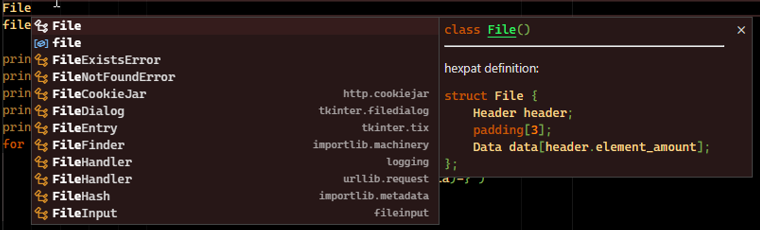

Convert your hexpat (ImHex's pattern language) scripts to python scripts.

You can see the documentation of the language [here](https://imhex.werwolv.net/docs/): [ImHex docs](https://imhex.werwolv.net/docs/)

This project is incomplete so it won't parse entire scripts completely. It is not forgiving with the formatting of the input file, you can see valid input files in the `examples` folder.

# Features
* Turn structs into python classes
* Turn bitfields into python classes (Don't rely on this without testing)

Docstrings contain the original hexpat syntax.



If you want syntax highlighting in vscode (like in the image), you can use [this extension](https://github.com/Calcoph/vscode-hexpat)

# Installation
Just download `main.py` and `primitives.py`. You will need a modern version of python3 (so at least it supports f-strings)

# Usage
### Option 1
Edit `main.py` to enter the file paths
```
input_file_path = ""
output_file_path = ""
```
Then run it
```console
> python main.py
```
### Option 2
Import it into another python file and use the `translate_file` function. It's strongly recommended that you rename the file in that case
```python
from main import translate_file

translate_file("examples/bin_file.pat", "examples/bin_file.py")
```

